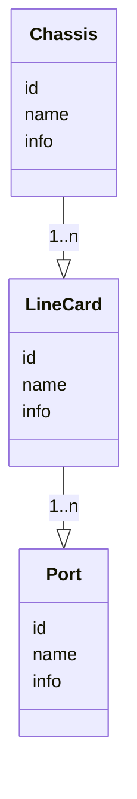
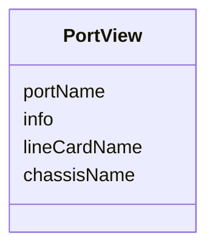
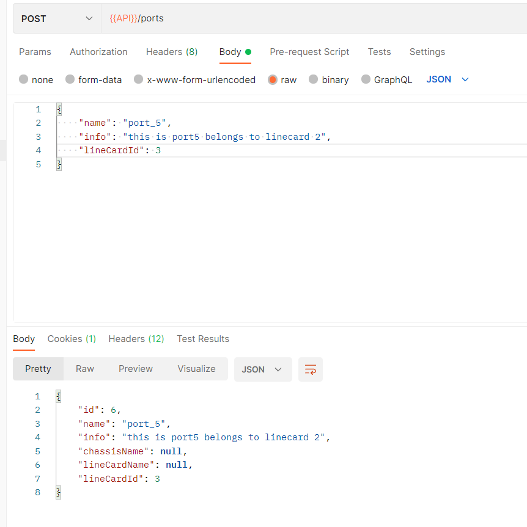
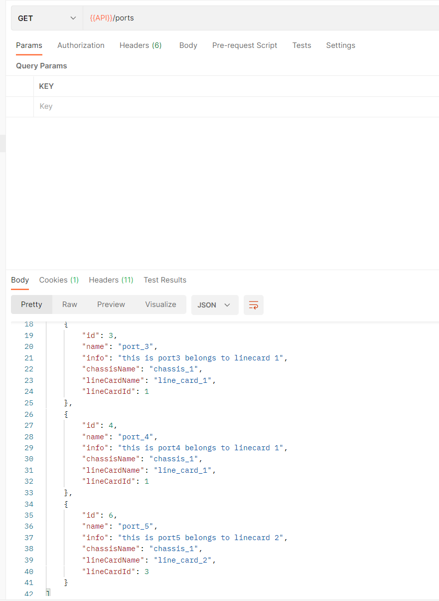
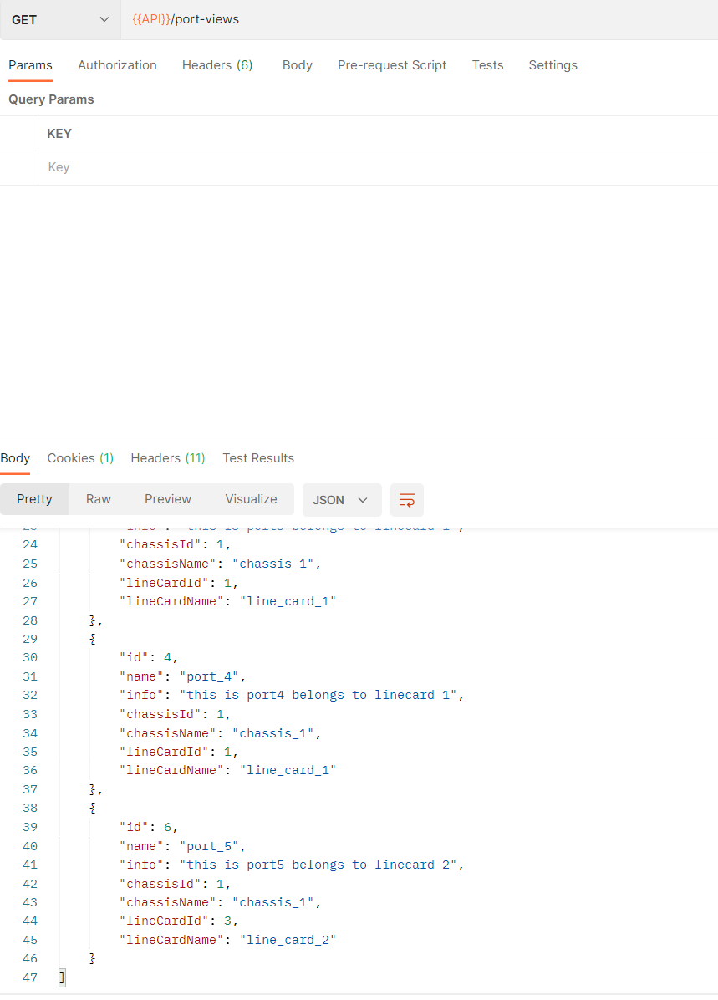

## 场景

对于一个实际的应用场景: 

一个机框下有多个板卡, 一个板卡下有多个端口

我们现在需要一个端口的展示列表, 需要展示端口本身信息的同时展示板卡和机框的名称, 而不需要板卡和机框的多余信息

### 数据关系



### 前端需要展示的资源

我们将前端需要展示的port称为`PortView`, `PortView`需要展示如下内容



## 方案 (基于jhipster)

### 如果数据库没有创建, 实体刚刚建立

可以直接在port创建的时候加入lineCardName和chassisName字段

然后使用mapstruct和dto来完成这个操作: 

```java
entity Chassis {
	name String
	info String
}

entity LineCard {
	name String
    info String
}

entity Port {
	name String
    info String
    chassisName String
   	lineCardName String
}

service * with serviceClass
dto * with mapstruct
filter *
paginate * with pagination

relationship OneToMany {
	Chassis{lineCard} to LineCard{chassis}
}

relationship OneToMany {
	LineCard{port} to Port{lineCard}
}

```

### 如果是已经创建的实体并且其上已经有一定的业务逻辑

这个可以概括为一个问题: 

> **如何用jhipster创建并管理一个View?**

目前我想到的方案包括下面三个方向, 但是能否行得通我并没有进行详细的测试, 持保留态度: 

- jhipster的`ReadOnly` Entity + 数据库的View (基于liquibase创建)
- jhipster的`mapstruct` + `dto` + `relationship` 
  - https://www.jhipster.tech/cn/using-dtos/

#### 基于mapstruct + dto + relationship

为了保存上述的数据, 我们当然可以创建如下的JDL

```java
entity Chassis {
	name String
	info String
}

entity LineCard {
	name String
    info String
}

entity Port {
	name String
    info String
    chassisName String
   	lineCardName String
}

service * with serviceClass
dto * with mapstruct
filter *
paginate * with pagination

relationship OneToMany {
	Chassis{lineCard} to LineCard{chassis}
}

relationship OneToMany {
	LineCard{port} to Port{lineCard}
}

```

然后修改dto的mapper即可实现了!

```java
// PortMapper
package com.roccoshi.micro.service.mapper;

import com.roccoshi.micro.domain.*;
import com.roccoshi.micro.service.dto.PortDTO;

import org.mapstruct.*;

/**
 * Mapper for the entity Port and its DTO PortDTO.
 */
@Mapper(componentModel = "spring", uses = {LineCardMapper.class})
public interface PortMapper extends EntityMapper<PortDTO, Port> {

    // Port的lineCard的某些字段 对应 portDTO本身的什么字段
    @Mapping(source = "lineCard.id", target = "lineCardId")
    @Mapping(source = "lineCard.name", target = "lineCardName")
    @Mapping(source = "lineCard.chassis.name", target="chassisName")
    PortDTO toDto(Port port);

    @Mapping(source = "lineCardId", target = "lineCard")
    Port toEntity(PortDTO portDTO);

    default Port fromId(Long id) {
        if (id == null) {
            return null;
        }
        Port port = new Port();
        port.setId(id);
        return port;
    }
```

##### portman (新增)



##### postman (查询)



#### 基于liquibase + view

考虑到上面一个方案的问题就是, 其会涉及到对三个实体的代码做更改, 有时候我们二次开发了许多业务逻辑, 这样更改实体的relation会对业务造成很大的变更影响, 这时候可以考虑新建一个`view`, 同时生成一个"只读"的实体来解决

比如我们新建一个`PortView`, 代码如下

```java
entity PortView {
	name String
    info String
    chassisId Long
    chassisName String
    lineCardId Long
   	lineCardName String
}

filter *
paginate * with pagination
```

这时候liquibase会生成这样的`changelog`: 

```xml
<?xml version="1.0" encoding="utf-8"?>
<databaseChangeLog
    xmlns="http://www.liquibase.org/xml/ns/dbchangelog"
    xmlns:ext="http://www.liquibase.org/xml/ns/dbchangelog-ext"
    xmlns:xsi="http://www.w3.org/2001/XMLSchema-instance"
    xsi:schemaLocation="http://www.liquibase.org/xml/ns/dbchangelog http://www.liquibase.org/xml/ns/dbchangelog/dbchangelog-3.5.xsd
                        http://www.liquibase.org/xml/ns/dbchangelog-ext http://www.liquibase.org/xml/ns/dbchangelog/dbchangelog-ext.xsd">

    <property name="now" value="now()" dbms="h2"/>
    
    <property name="now" value="now()" dbms="mysql"/>
    <property name="autoIncrement" value="true"/>

    <property name="floatType" value="float4" dbms="postgresql, h2"/>
    <property name="floatType" value="float" dbms="mysql, oracle, mssql"/>

    <!--
        Added the entity PortView.
    -->
    <changeSet id="20220806151655-1" author="jhipster">
        <createTable tableName="port_view">
            <column name="id" type="bigint" autoIncrement="${autoIncrement}">
                <constraints primaryKey="true" nullable="false"/>
            </column>
            <column name="name" type="varchar(255)">
                <constraints nullable="true" />
            </column>

            <column name="info" type="varchar(255)">
                <constraints nullable="true" />
            </column>

            <column name="chassis_id" type="bigint">
                <constraints nullable="true" />
            </column>

            <column name="chassis_name" type="varchar(255)">
                <constraints nullable="true" />
            </column>

            <column name="line_card_id" type="bigint">
                <constraints nullable="true" />
            </column>

            <column name="line_card_name" type="varchar(255)">
                <constraints nullable="true" />
            </column>

            <!-- jhipster-needle-liquibase-add-column - JHipster will add columns here, do not remove-->
        </createTable>
        
    </changeSet>
    <!-- jhipster-needle-liquibase-add-changeset - JHipster will add changesets here, do not remove-->
</databaseChangeLog>
```

我们将之更改为: 

```xml
<?xml version="1.0" encoding="utf-8"?>
<databaseChangeLog
    xmlns="http://www.liquibase.org/xml/ns/dbchangelog"
    xmlns:ext="http://www.liquibase.org/xml/ns/dbchangelog-ext"
    xmlns:xsi="http://www.w3.org/2001/XMLSchema-instance"
    xsi:schemaLocation="http://www.liquibase.org/xml/ns/dbchangelog http://www.liquibase.org/xml/ns/dbchangelog/dbchangelog-3.5.xsd
                        http://www.liquibase.org/xml/ns/dbchangelog-ext http://www.liquibase.org/xml/ns/dbchangelog/dbchangelog-ext.xsd">

    <property name="now" value="now()" dbms="h2"/>

    <property name="now" value="now()" dbms="mysql"/>
    <property name="autoIncrement" value="true"/>

    <property name="floatType" value="float4" dbms="postgresql, h2"/>
    <property name="floatType" value="float" dbms="mysql, oracle, mssql"/>

    <!--
        Added the entity PortView.
    -->
    <changeSet id="20220806151655-1" author="moreality">
        <createView catalogName="microname" viewName="port_view" replaceIfExists="true">
            select p.id, p.name, p.info, p.line_card_id, l.name as line_card_name, c.name as chassis_name, c.id as chassis_id
            from port as p
            left join line_card as l on l.id = p.line_card_id
            left join chassis as c on c.id = l.chassis_id
            <!-- jhipster-needle-liquibase-add-column - JHipster will add columns here, do not remove-->
        </createView>

    </changeSet>
    <!-- jhipster-needle-liquibase-add-changeset - JHipster will add changesets here, do not remove-->
</databaseChangeLog>
```

也就是建立一个同名的view, 然后自己将联表查询的sql写好

之后不需要做任何事情, 就通过`api/port-views`查到相关的view了 (最好把api的post和put都删了)

##### postman (查询)



